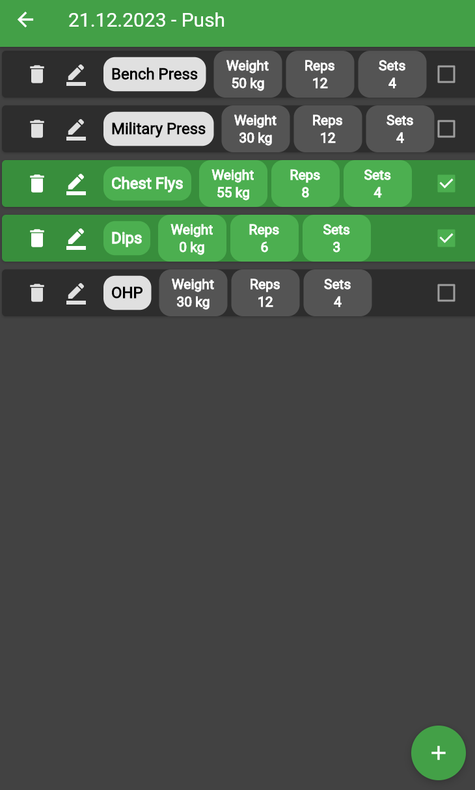
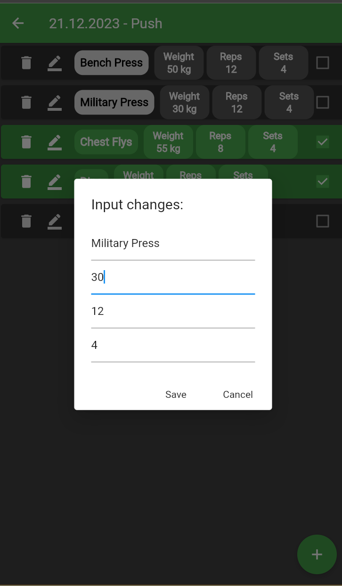

# Workout App

## Introduction

Workout App is a mobile application developed using Flutter. It provides a user-friendly interface for tracking and managing workout routines. The app allows users to create custom exercises, track their progress, and visualize workout history using a heatmap calendar.

## Features

- **Exercise Tracking**: Users can create exercises and track their progress by recording the weight, reps, and sets for each exercise.
- **Heatmap Calendar**: The app displays a heatmap calendar to visualize workout history. Each day is color-coded based on the intensity of the workout (In development).
- **User-Friendly Interface**: The app features a clean and intuitive interface, making it easy for users to navigate and track their workouts.

## Screenshots

  
  

## Origin
The base for entire app was provided by Mitch Koko's [tutorial](https://www.youtube.com/watch?v=ZWciJzsPyPs&t=9s).

## How It Works

The Workout App follows a simple workflow to help users track their workouts effectively:

1. **Exercise Tracking**: Users can create exercises by providing the exercise name, weight, reps, and sets. This information is then stored in the app's database for future reference.

2. **Exercise Progress**: Users can mark exercises as completed by toggling the checkbox next to each exercise. This allows users to track their progress and ensure they complete their planned workouts.

3. **Heatmap Calendar**: The Heatmap tab in the app displays a calendar view where users can visualize their workout history. Each day is color-coded based on the intensity of the workout. Darker shades indicate more intense workouts, while lighter shades represent less intense workouts or rest days.

4. **Insights and Analysis**: By observing the heatmap calendar, users can gain insights into their workout patterns and identify trends. This information can help users make informed decisions about adjusting their workout routines for better results.

5. **Hive Database**: There is a number of ways to go about it, but Hive databases only store simple type data for example String, Int and List, workouts and exercises are objects, thats why i used neat little trick to convert the objects into Lists and Strings using methods (But there are other ways too).

## Installation

To run the Workout App locally, follow these steps:

1. Ensure that you have Flutter installed. If not, refer to the [Flutter installation guide](https://flutter.dev/docs/get-started/install) for your platform.
2. Clone this repository: `git clone "https://github.com/myszopanda/flutter_workout_app"`
3. Navigate to the project directory: `cd workout-app`
4. Install dependencies: `flutter pub get`
5. Run the app: `flutter run`

Note: Make sure you have a compatible mobile device or emulator set up before running the app, i developed it using edge app development so it might not work exactly perfectly on android.

## Usage

1. Launch the Workout App on your device.
2. On the home screen, you will see a list of exercises.
3. Tap on the "+" button to add a new exercise.
4. Enter the exercise details, including name, weight, reps, and sets.
5. Save the exercise.
6. The exercise will now appear in the list with its details.
7. To mark an exercise as completed, toggle the checkbox next to it.
8. To view the heatmap calendar, navigate to the Heatmap tab (During implementation).
9. The calendar will display a color-coded representation of your workout history.

## Future plans

- **Themes**: Modify the color scheme and styles to match your personal preferences.
- **Additional Features**: Extend the app by adding features like workout reminders, exercise statistics, or social sharing.
- **AI/Machine learning**: Generating future workouts based on the current data and users preference.
- **Drag & drop** interface to move workouts and exercises around.
- **UI/UX Tweaks**: Make the app look more approachable.

## Common Usages

The Workout App can be used in various scenarios, including:

1. **Personal Fitness Tracking**: Use the app to track your personal fitness journey, set goals, and monitor your progress over time.
2. **Gym Workouts**: Plan and record your workouts at the gym, keeping track of the exercises, weights, and reps for each session.
3. **Home Workouts**: Create custom exercise routines for home workouts and maintain a log of your activities.
4. **Fitness Challenges**: Participate in fitness challenges or programs and utilize the app to track your performance and stay motivated.

## Contributing

Contributions to the Workout App are welcome! If you encounter any issues or have suggestions for improvements, please open an issue or submit a pull request on the GitHub repository.

## License

This project is licensed under the [MIT License](LICENSE).

## Acknowledgements

- The Flutter framework: [https://flutter.dev/](https://flutter.dev/)
- Flutter Hive package: [https://pub.dev/packages/hive](https://pub.dev/packages/hive)
- Flutter Heatmap Calendar package: [https://pub.dev/packages/flutter_heatmap_calendar](https://pub.dev/packages/flutter_heatmap_calendar)

## Contact

For any inquiries or questions, please contact me via gitHub.
